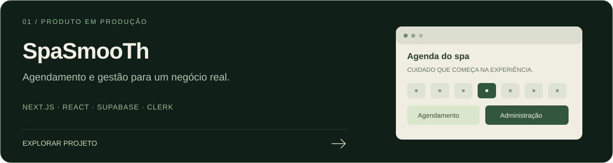
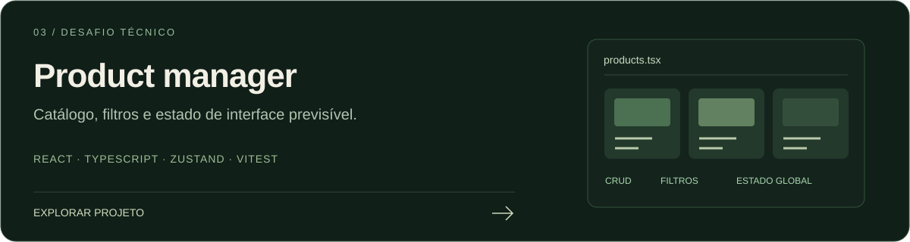

  <a href="https://wesleycaiadev.vercel.app/"><strong>PORTFÓLIO ↗</strong></a>
  &nbsp;&nbsp; / &nbsp;&nbsp;
  <a href="https://www.linkedin.com/in/wesley-caia-dev/"><strong>LINKEDIN ↗</strong></a>
  &nbsp;&nbsp; / &nbsp;&nbsp;
  <a href="mailto:wesleycaia.dev@gmail.com"><strong>VAMOS CONVERSAR ↗</strong></a>

 

### 01 / Sobre mim

Sou **Wesley Caiã**, desenvolvedor Front-end em Aracaju/SE. Gosto do encontro entre engenharia e design: componentes bem estruturados, navegação clara e movimento que ajuda a contar uma história.

Trabalho com **React, Next.js, Angular e TypeScript**. Meus projetos vão de aplicações de estudo a produtos usados por negócios reais, com agendamento, catálogos e painéis administrativos.

**Meu foco:** interfaces responsivas, acessibilidade, performance e atenção ao acabamento.

 

### 02 / Projetos selecionados

**Do serviço ao atendimento:** fluxo de agendamento por unidade, profissional e horário; gestão de agenda e conteúdo no painel administrativo.

[Visitar o site ↗](https://spasmooth.com.br/) · [Explorar o código ↗](https://github.com/wesleycaiadev/spasmooth-landing)

 

**Da busca à decisão:** showroom com filtros, detalhes dos veículos, busca personalizada e gestão de catálogo. Angular com SSR, Signals e componentes standalone.

[Explorar o código e a arquitetura ↗](https://github.com/wesleycaiadev/consultor-automotivo)

 

**Da interface ao comportamento:** CRUD, busca, filtros e formulários, com estado global por domínio e testes de componentes.

[Explorar o desafio técnico ↗](https://github.com/wesleycaiadev/desafio-frontend-ma9)

As capas são ilustrações autorais dos projetos, não capturas das aplicações.

  

### 03 / Caixa de ferramentas

| Interfaces | Design & experiência | Qualidade & entrega |
| :--- | :--- | :--- |
| React · Next.js · Angular | HTML · CSS · SCSS · Tailwind | Git · GitHub · CI/CD |
| TypeScript · JavaScript | GSAP · Motion · Storybook | Jest · Vitest · Docker |
| Signals · Zustand | Responsividade · Acessibilidade | Supabase · Clerk · Vercel |

 

### 04 / Como penso o front-end

**Estrutura antes de escala.** Componentes com responsabilidades claras e estado próximo de onde é usado.

**Design que funciona.** Hierarquia, contraste, navegação por teclado e layouts pensados também para telas pequenas.

**Movimento com propósito.** Transições e microinterações para orientar a experiência, respeitando performance e redução de movimento.

 

### 05 / Construindo em público

Mais código e experimentos: [VG-TECH](https://github.com/wesleycaiadev/VG-TECH) · [Fokus](https://github.com/wesleycaiadev/fokus-projeto) · [Todos os repositórios](https://github.com/wesleycaiadev?tab=repositories).

Meu histórico real de contribuições está no calendário nativo abaixo dos repositórios fixados. A matriz animada do cabeçalho é uma assinatura visual, inspirada nesse calendário.

 

---

  <strong>Tem uma oportunidade ou um projeto em mente?</strong> 
  Vamos transformar a ideia em uma experiência que vale a pena usar.  
  <a href="mailto:wesleycaia.dev@gmail.com">wesleycaia.dev@gmail.com</a>
  &nbsp; · &nbsp;
  <a href="https://www.linkedin.com/in/wesley-caia-dev/">LinkedIn</a>

<!--
Artes SVG autorais, versionadas neste repositório, sem scripts ou fontes remotas.
A animação respeita prefers-reduced-motion.
Referências de estrutura e possibilidades de README:
https://github.com/abhisheknaiidu/awesome-github-profile-readme
https://github.com/DenverCoder1/DenverCoder1
https://github.com/Platane/snk
-->
